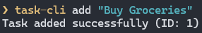
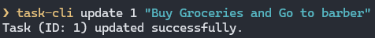
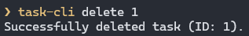
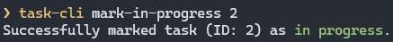
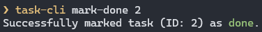
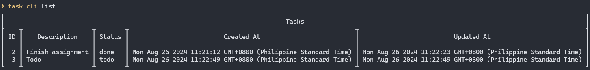
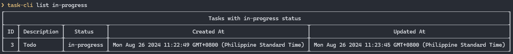
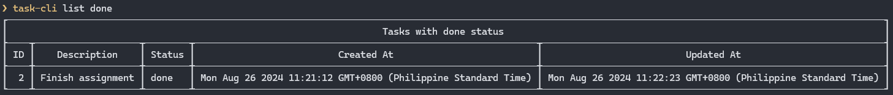

## Task Tracker CLI

> [!IMPORTANT]
> I'm going to rewrite this as I didn't see the constraints of the project.

This is a simple Task Tracker CLI made using commander.js. It is based on the [roadmap.sh](https://roadmap.sh/projects/task-tracker) project.

### Preview

1. Add  
   

2. Update  
   

3. Delete  
   

4. Mark as in-progress  
   

5. Mark as done  
   

6. List
   

7. List with status
   
   
   

### Prerequisites

    - MySQL database (you can change it to any database you want. You are free to do so.)
    - Node.JS
    - pnpm (optional, you can just use npm or yarn)

### Installation & Steps to run

-   Clone this repository
-   Run `pnpm install` or if you don't have pnpm installed, run `npm install` or `yarn install` instead.
-   Run `pnpm prisma db push` or if you don't have pnpm installed, run `npx prisma db push`

> [!NOTE]  
> You need to change the [schema.prisma](./prisma/schema.prisma) first if you are planning to use
> other database.

-   Run npm link
-   Run `task-cli`
